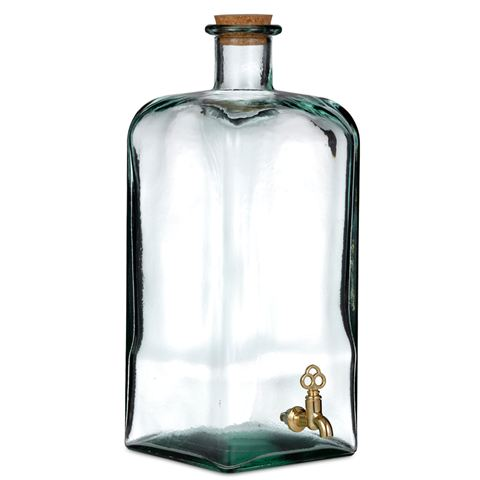

# Procuder/consumer pattern for thread communication and/or syncronization in C.

> This project implements a communication and synchronization mechanism between producer and consumer threads.

Some threads can produce and send messages, which are received and consumed by other threads.
Exchanged message are strongly type -- they are bound to a chosen (or void) type of objects specific to each channel of communication.

Besides, communication channels can be synchronized with an adjustable constraint:

  - either tight: producer (or team of producers) and consumer (or team of consumers) work at same pace ;
  - or loose : producer (or team of producers) and consumer (or team of consumers) work at their own pace ;
  - or anything in between.

The pattern of message driven synchronization is of interest because it is intuitive and of a higher level
of abstraction than mutexes and conditions:

- some threads `A` (usually called the senders or the producers) fill the message queue ;
- some other threads `B` (usually called the receivers or the consumers) eat up the message queue.

Threads B are gracefully synchronized with threads A.

Therefore, I grabbed my copy of the (still great) book "Programming with POSIX threads" by Butenhof, where the pattern is mentionned, to
implement it for my favorite language, C.

And here it is.

Under the hook, this pattern is a thread-safe FIFO message queue suited for thread synchronization.

It hides mutexed and thread synchronization complexity behind simple objects, called *bottles*, similar for example to the concept of *channels* found in language Go
(which shows a nice and minimalistic grammar and overall simplicity, as compared to C++ or Java).

The API is simple : declare and define a channel (*bottle*) and the type of messages bound to it, create a channel, send and receive messages, close and destroy the channel:

```c
#include <unistd.h>
#include <stdio.h>

#include "bottle_impl.h"        // Include necessary stuff
typedef const char *Message;
DECLARE_BOTTLE (Message);       // Declare the template for type 'Message'
DEFINE_BOTTLE (Message);        // Define the template for type 'Message'

static void *
eat (void *arg)                 // The thread that receives the messages
{
  bottle_t (Message) * bottle = arg;
  Message m;
  while (bottle_recv (bottle, m))       // Receive a message
    printf ("...%s\n", m);
  return 0;
}

int
main (void)
{
  bottle_t (Message) * bottle = bottle_create (Message);        // create a bottle (on the sender side), unbuffered, for communication and synchronization

  // 10 consumers
  pthread_t eater[10];
  for (pthread_t * p = eater; p < eater + sizeof (eater) / sizeof (*eater); p++)
    pthread_create (p, 0, eat, bottle);

  // 1 producer
  Message police[] = { "I'll send an SOS to the world", "I hope that someone gets my", "Message in a bottle" };
  for (Message * m = police; m < police + sizeof (police) / sizeof (*police); m++)
  {
    printf ("%s...\n", *m);
    bottle_send (bottle, *m);   // Send a message
    sleep (1);
  }

  bottle_close (bottle);        // close the bottle (tells the receiver threads that all messages have been sent.)
  for (pthread_t * p = eater; p < eater + sizeof (eater) / sizeof (*eater); p++)
    pthread_join (*p, 0);       // Waits for the receiver thread to finish its work (it uses the bottle).
  bottle_destroy (bottle);      // Destroys the bottle once receiver threads are over.
}
```

Details, discussions and examples are given below.

**Have fun !**

## Thread synchronization through messages

Threads can synchronize using the producer/consumer pattern. Consumer threads (possibly several) trigger when they receive
messages sent by producer threads (possibly several).

Each message is consumed by at most one consumer thread.

Messages are managed in a thread-safe message queue (called *bottle* thereafter).

### Unbuffered message queue

The created message queue is unbuffered by default.
Such an unbuffered queue is suitable for a tight synchronization between threads running concurrently.

### Buffered message queue

Even if unbuffred queues are efficient in most cases, buffered queues can be needed for specific use cases:

- to limit the number of thread workers,
- in case of a very high rate (more than 100k per second) of exchanged messages
  between the sender thread and the receiver thread,
  where context switch overhead between threads would be counter-productive. The buffer capacity will allow to process
  sending and receiving messages by chunks, therefore reducing the number of context switch.
- In case the receiver is slower to process received messages than the sender to send them.
  Using a buffered message queue avoids blocking the sender inadequately,
  where an unbuffered queue would tune the pace of the sender on the one of the receiver, slowing down the sender thread.

For this purpose, an optional argument *capacity* can be passed at creation of a message queue.

- A *capacity* set to a positive integer defines a buffered queue of fixed and limited capacity.

    This configuration relaxes the synchronization between threads.

    This could also be used to manage tokens: *capacity* is then the number of available tokens.
    Call `BOTTLE_TRY_FILL` to request a token, and call `BOTTLE_TRY_DRAIN` to release a token.
    The bottle is then used as a container of controlled capacity.
    `BOTTLE_CLOSE` need not be used in this case.
    There is such an example below.

- A *capacity* set to `UNBUFFERED` or 1 defines an unbuffered queue (default, suitable for most purposes.)

  This the choice for thread synchronization through messages.

- A *capacity* set to `UNLIMITED` or 0 defines a queue of infinite capacity.

  This configuration allows easy communication between producers and consumers without any constraints on synchronization.
  It can be useful for asynchronous I/O for example, as in [`hanoi.c`](examples/hanoi.c).

  It allocates and desallocates capacity dynamically as needed for messages in the pipe between producers and consumers.
  It is therefore slower than an `UNBUFFERED` queue or a queue with fixed capacity.
  It should be used with care as it could exhaust memory if the producer rate exceeds dramatically the consumer rate.

Buffered queues are implemented as preallocated arrays rather than as conventional linked-list:
elements of the array are reused to transport all messages,
whereas with a linked list, each message would require a dynamically allocated new element in the list, adding memory management pverhead.
This design is inspired by the [LMAX Disruptor pattern](https://lmax-exchange.github.io/disruptor/).

*As said before, the usage of buffered queues is neither required nor recommended for thread synchronization, as it would partly unsynchronize threads and uses a larger amount of memory ; `UNBUFFERED` queues are suitable for most purposes.*

## Insights of the user interface

The user interface is available in two styles, a macro-like and a C-like style.
Those two are strictly equivalent:

|| Description          | Macro-like style                    | C-like style|
|-|---------------------|-------------------------------------|-------------|
|**Declaration and definition of bottle type** |
||Type declaration      | `DECLARE_BOTTLE(`*T*`)`             | `bottle_type_declare(`*T*`)`
||Type definition       | `DEFINE_BOTTLE(`*T*`)`              | `bottle_type_define(`*T*`)`
||Type                  | `BOTTLE(`*T*`)`                     | `bottle_t(`*T*`)`
|**Automatic allocation of a bottle** |
||Declare and create    | `BOTTLE_DECL`                       | `bottle_auto`
|**Dynamic allocation** |
||Create                | `BOTTLE_CREATE`                     | `bottle_create`
||Destroy               | `BOTTLE_DESTROY`                    | `bottle_destroy`
|**Sending and receiving** |
|*Blocking* |
||Send message          | `BOTTLE_FILL`                       | `bottle_send`
||Receive message       | `BOTTLE_DRAIN`                      | `bottle_recv`
|*Non blocking* |
||Try sending message   | `BOTTLE_TRY_FILL`                   | `bottle_try_send`
||Try receiving message | `BOTTLE_TRY_DRAIN`                  | `bottle_try_recv`
|**Closing** |
||Close sending channel | `BOTTLE_CLOSE`                      | `bottle_close`
|**Halting** |
||Plug                  | `BOTTLE_PLUG`                       | `bottle_plug`
||Unplug                | `BOTTLE_UNPLUG`                     | `bottle_unplug`
|**Properties**         |
||Is plugged            | `BOTTLE_IS_PLUGGED`                 | `bottle_is_plugged`
||Is closed             | `BOTTLE_IS_CLOSED`                  | `bottle_is_closed`
||Get buffer capacity   | `BOTTLE_CAPACITY`                   | `bottle_capacity`

The following text uses the macro-like style but the equivalent C-like style can be used as well.

### Declaration (allocation) of bottles

 Bottles can be created either dynamically or with an automatically allocation.

#### Creation of a bottle, dynamically

> BOTTLE (*T*) \* **BOTTLE_CREATE** (*T*, [size_t capacity = UNBUFFERED])
>
> *The second argument is optional and defaults to `UNBUFFERED` (see **Buffered message queue** above).*

To transport messages of type *T*, `BOTTLE_CREATE` creates a pointer to a dynamically allocated message queue.

*T* could be any standard or user defined (`typedef`) type, simple or composed structure (`struct`).

For instance, to create a pointer to a message queue *b* for exchanging integers between threads, use:

`BOTTLE (int) *b = BOTTLE_CREATE (int);`

The message queue is **a strongly typed** (it is a hand-made template container) FIFO queue.

To create a pointer to a **buffered** message queue, pass its *capacity* as an optional (positive integer
or `UNLIMITED`) second argument of `BOTTLE_CREATE` :

`BOTTLE(` *T* `) *`*bottle* ` = BOTTLE_CREATE (` *T* `, ` *capacity* `);`

##### Destruction of a bottle dynamically allocated

> void **BOTTLE_DESTROY** (BOTTLE (*T*) \*bottle)

Thereafter, once *all the receivers are done* (see **Closing communication** below) in the user program,
and the bottle is not needed anymore, it can be destroyed safely with `BOTTLE_DESTROY`.

#### Declaration of local (automatic) variable

Rather than creating pointers to bottles, local variables of type BOTTLE (*T*) can as well be declared and initialized with `BOTTLE_DECL`.
These variables behave like automatic variables: resources are automatically allocated at declaration and deallocated at end of scope.

> **BOTTLE_DECL** (*variable name*, *T*, [size_t capacity = UNBUFFERED])
>
> `BOTTLE_DECL` can only be applied to auto function scope variables; it may not be applied to parameters
> or variables with static storage duration.

Note:

- `BOTTLE_DECL` is only available with compilers `gcc` and `clang` as it makes use of the variable attribute `cleanup`.
- `BOTTLE_DECL (b, int, 3)` is similar to what could be `bottle_t<int> b(3)` in C++ (if template class bottle_t were declared).

Here is an example of automatic allocation. The variable *b* is declared as a `bottle_t (time_t)` and initialized.
It is destroyed when the variable goes out of scope.

```c
#include <time.h>
#include "bottle_impl.h"

DECLARE_BOTTLE (time_t);
DEFINE_BOTTLE (time_t);

int main (void)
{
  BOTTLE_DECL (b, time_t);       // Declare an automatic variable b of type bottle_t (time_t)
  bottle_send (&b, time (0));    // Send a message through the bottle
  time_t val;
  bottle_recv (&b, val);         // Receive a message through the bottle and store it in `val`
  // b is deallocated automatically when going out of scope.
}
```

### Exchanging messages between threads

Sender threads communicate with receiver threads by exchanging messages through the bottle:
the bottle has a mouth where it can be filled with messages and a tap from where it can be drained.



<small>(c) Davis & Waddell - EcoGlass Oil Bottle with Tap Large 5 Litre | Peter's of Kensington</small>

#### Receiving messages

> int **BOTTLE_DRAIN** (BOTTLE (*T*) \*bottle, [*T*& message])
>
> *The second argument `message` is an optional variable name. If omitted, the bottle is drained but the message is not fetched and is lost.*
>
> *It is of type T& (a reference to a variable, *à la C++*).
> It is passed as a **reference**, and not as a pointer to T.
> As such, it might be modified by the callee (just a little bit of macro magic here).*


The receivers can receive messages (draining form the tap), as long as the bottle is not empty and not closed, by calling `BOTTLE_DRAIN (`*bottle*`, `*message*`)`.
The received message feeds the variable `message`.

- `BOTTLE_DRAIN` returns 0 immediately (with `errno` set to `ECONNABORTED`) if there is no data to receive
  **and** the bottle was previously closed (by `BOTTLE_CLOSE`, see below).

    This condition (returned value equal to 0) should be handled
    by the receivers to detect the end of communication between threads (end of reception of data from the bottle).

- If there is data to receive, `BOTTLE_DRAIN` receives a *message* from the bottle
  (it modifies the value of the second argument *message* passed by *"reference"*) and returns 1 immediately.

  Messages are received in the **exact order** they have been sent, whatever the capacity of the buffer defined by `BOTTLE_CREATE`.

- Otherwise (there is no data to receive and the bottle is not closed), `BOTTLE_DRAIN` waits
  until there is data to receive. *It is precisely this behavior that ensures synchronicity between the sender and the receiver*.

Therefore `BOTTLE_DRAIN` returns 1 if a message has been sucessfully received from the bottle, 0 otherwise.

#### Sending messages

> int **BOTTLE_FILL** (BOTTLE (*T*) \*bottle, [*T* message])
>
> *The second argument is optional. If omitted, an arbitrary unspecified dummy message is used to fill the bottle.*

The senders can send messages (filling in through the mouth of the bottle)
by calling `BOTTLE_FILL (`*bottle*`, `*message*`)`, as long as the mouth is open
and the botlle is not closed.

- `BOTTLE_FILL` waits in those cases:

    - If the bottle was plugged (by `BOTTLE_PLUG`, see below), `BOTTLE_FILL` blocks until the bottle is unplugged (by `BOTTLE_UNPLUG`).
    - If the message queue is **unbuffered** (`UNBUFFERED`, recommended), `BOTTLE_FILL` blocks until some receiver has received
      the value sent by a previous sucessful call to `BOTTLE_FILL` or `BOTTLE_TRY_FILL`.
      *It is precisely this behavior that ensures synchronicity between the sender and the receiver*.
    - If the message queue  is **buffered** and the buffer is of limited capacity and full,
    `BOTTLE_FILL` blocks until some receiver has
      retrieved at least one value previously sent (with `BOTTLE_DRAIN` or `BOTTLE_TRY_DRAIN`).
      
      Note: if the bottle has `UNLIMITED` capacity, it is never full as its capacity increases automatically as necessary to accept new messages (like a skin ballon).

- `BOTTLE_FILL` returns 0 (with `errno` set to `ECONNABORTED`) in those cases:

    - immediately, without waiting, if the bottle was previously closed (by `BOTTLE_CLOSE`, see below).
    - as soon as the bottle is closed (by `BOTTLE_CLOSE`) while waiting.

      This returned value most probably indicates an error in the logic of the user program as
      it should be avoided to close a bottle while senders are still using it.

      Anyhow, this condition (returned value equal to 0) should be handled
      by the senders (which should stop the transmission of any data to the bottle).

- In other cases, `BOTTLE_FILL` sends the message in the bottle and returns 1.

Therefore `BOTTLE_FILL` returns 1 if a message has been sucessfully sent in the bottle, 0 otherwise.

#### Resources management

In particular and unusual case where the message type *T* would be or would contain (in a structure) allocated resources (such as memory with `malloc`/`free` or file descriptor with `fopen`/`fclose` for instance),
the user program must respect those simple rules:

- The **sender**:

    - *must* allocate resources of the message before sending it (i.e. before the call to functions `BOTTLE_FILL` or `BOTTLE_TRY_FILL`);

    - *should not* try to access those allocated ressources after the message has been sent (i.e. after the call to functions `BOTTLE_FILL` or `BOTTLE_TRY_FILL`).

    Indeed, as soon as a message is sent, it is owned by the receiver (which could modify it)
    and **does not belong to the sender anymore**.


- The **receiver** *must*, after receiving a message
  (i.e. after the call to functions `BOTTLE_DRAIN` or `BOTTLE_TRY_DRAIN`), and after use of the message,
  deallocate (release) all the resources of the message (those previously allocated by the sender).

### Closing communication

> void **BOTTLE_CLOSE** (BOTTLE (*T*) \*bottle)

When concurrent threads are synchronized by an exchange of messages, the senders must inform the receivers
when they have finished sending messages, so that receivers won't need to wait for extra messages (see `BOTTLE_DRAIN` above).

In other words, as soon as all messages have been sent through the bottle (it won't be filled with any more messages), the bottle can be closed on the sender side.

To do so, the function `BOTTLE_CLOSE` seals the mouth of the bottle
(i.e. closes the transmitter side of the bottle permanently),
and unblocks all receivers waiting for messages.

The call to `BOTTLE_CLOSE`, *on the sender side*:

1. prevents any new message from being sent in the bottle (just in case) :
  `BOTTLE_FILL` and `BOTTLE_TRY_FILL` will return 0 immediately (without blocking).
2. and then asks for any remaining blocked calls to `BOTTLE_DRAIN` (called by the receivers) to unblock and
   to finish their job:
   all pending calls to `BOTTLE_DRAIN` will be asked to return immediately with value 0 (see above).

`BOTTLE_CLOSE` acts as if it were sending an end-of-file in the bottle.

    Therefore, the call to `BOTTLE_CLOSE` *must be done*
    after the senders have finished their work (either at the end
    or sequentially just after the sender treatment).

Notes:

- After the call to `BOTTLE_CLOSE` by the sender, receivers are still able to (and *should*) process the remaining messages in the bottle to avoid any memory leak due to unprocessed remaining messages.

- The user program *must* wait for all the receiver treatments to finish
  (usually, waiting for the receivers to finish with a `pthread_join` might suffice)
  before destroying the bottle (with `BOTTLE_DESTROY`).

- As said above, `BOTTLE_CLOSE` is *only useful when the bottle is used to synchronize concurrent
threads* on sender and reciever sides and need not be used in other cases (thread-safe shared FIFO queue).

- `BOTTLE_DESTROY` does not call `BOTTLE_CLOSE` by default because the user program *should
ensure* that all receivers have finished their work between `BOTTLE_CLOSE`
and `BOTTLE_DESTROY`.

### Other features

#### Unblocking message queue functions

> int **BOTTLE_TRY_DRAIN** (BOTTLE (*T*) \*bottle, [*T* message])
>
> *The second argument is optional. If omitted, the bottle is drained but the message is lost.*

> int **BOTTLE_TRY_FILL** (BOTTLE (*T*) \*bottle, [*T* message])
>
> *The second argument is optional. If omitted, an arbitrary unspecified dummy message is used.*

These are unblocking versions of the filling and draining functions.

These functions return immediately without blocking. *They are **not** suited for thread synchronization* and are of limited use.

When used, the message queue looses its thread-synchronization feature and
behaves like a simple thread-safe FIFO message queue:

- Receivers can receive messages without blocking with `BOTTLE_TRY_DRAIN (`*bottle*`, `*message*`)`.

    - `BOTTLE_TRY_DRAIN` returns 0 (with `errno` set to `ECONNABORTED`) if the bottle is empty and closed.
    - `BOTTLE_TRY_DRAIN` returns 0 (with `errno` set to `EWOULDBLOCK`) if the bottle is empty.
    - Otherwise, it receives a *message* (it modifies the value of the second argument *message*)
      from the bottle and returns 1.

- Senders can send messages without blocking with `BOTTLE_TRY_FILL (`*bottle*`, `*message*`)`.

    - `BOTTLE_TRY_FILL` returns 0 if the bottle is closed (with `errno` set `ECONNABORTED`).
    This most probably indicates an error in the user program as it should be avoided to close a bottle
    while senders are still using it.
    - `BOTTLE_TRY_FILL` returns 0 if the bottle is plugged (with `errno` set `EWOULDBLOCK`) or already full.
    This indicates that a call to `BOTTLE_FILL` would have blocked.
    - Otherwise, it sends a *message* in the bottle and returns 1.

Notice that the second argument *message* is of type *T*, and not a pointer to *T*,
even though it might be modified by `BOTTLE_TRY_DRAIN` (macro magic here).

#### Halting communication

> void **BOTTLE_PLUG** (BOTTLE (*T*) \*bottle)

> void **BOTTLE_UNPLUG** (BOTTLE (*T*) \*bottle)

The communication between sender and receiver threads can be stopped and restarted at will if needed.
The mouth of the bottle can be:

- plugged (stopping communication) with `BOTTLE_PLUG`,
- unplugged (to restart communication) with `BOTTLE_UNPLUG`.

#### Getting the capacity of a bottle

> size_t **BOTTLE_CAPACITY** (BOTTLE (*T*) \*bottle)

`BOTTLE_CAPACITY` returns the capacity of the bottle (as defined at creation with `BOTTLE_CREATE`):

 - A value equal to `UNBUFFERED` (or 1) indicates an unbuffered bottle.
 - A positive number indicate a buffered bottle of limited capacity.
 - A value equal to `UNLIMITED` (or 0) indicates a buffered bottle of unlimited capacity.

#### Hidden data

If the content of the messages is not needed, the argument *message* can be *omitted* in calls to
`BOTTLE_TRY_DRAIN`, `BOTTLE_DRAIN`, `BOTTLE_TRY_FILL` and `BOTTLE_FILL`.

In this case, a bottle is simply used as a synchronization method or a token counter.

## Usage

Before use:
1. include header file `bottle_impl.h`.
2. instanciate a template of a given type of messages with `DECLARE_BOTTLE` and `DEFINE_BOTTLE`.

For instance, to exchange message texts between threads, start code with:
```c
#include "bottle_impl.h"
typedef const char * TextMessage;   // A user-defined type of messages.
DECLARE_BOTTLE (TextMessage);       // Declares the usage of bottles for the user-defined type.
DEFINE_BOTTLE (TextMessage);        // Defines the usage of bottles for the user-defined type.
```

### Source files

- [`bottle.h`](bottle.h) declares the user interface documented here (about 100 lines of source code).
- [`bottle_impl.h`](bottle_impl.h) defines the user programming interface (about 200 lines of source code).
- [`vfunc.h`](vfunc.h) is used by [`bottle.h`](bottle.h). It permits usage of optional parameters in function signatures.

## Examples

All sources should be compiled with the option `-pthread`.

### Unbuffered bottle: Thread synchronization

[`bottle_example.c`](examples/bottle_example.c) is a complete example of a program (compile with option `-pthread`)
using a synchronized thread-safe FIFO message queue.

### Buffered bottle

#### High performance message exchanges

When high performance of exchanges is required between threads (more than 100 000 messages per seconds), a buffered bottle is a good choice (reminder: in other cases, an unbuffered bottle is far enough.)

In the following example, this enhances performance by a factor of about 40, because it cuts off the concurrency overhead.
On my computer (AMD A6 4 cores), it takes about 20 seconds to exchange 25 millions messages between synchronized threads.

```c
#include "bottle_impl.h"
DECLARE_BOTTLE (int);
DEFINE_BOTTLE (int);

#define NB_MESSAGES 25000000
#define BUFFER_SIZE 1000
//#define BUFFER_SIZE UNBUFFERED

static size_t LEVEL[2 * NB_MESSAGES];
static size_t nb_p, nb_c;

static void *eat (void *arg)
{
  bottle_t (int) * bottle = arg;
  while (bottle_recv (bottle))
    LEVEL[nb_c++ + nb_p] = QUEUE_SIZE (bottle->queue);
  return 0;
}

int
main (void)
{
  bottle_t (int) * bottle = bottle_create (int, BUFFER_SIZE);
  pthread_t eater;
  pthread_create (&eater, 0, eat, bottle);

  for (size_t i = 0; i < NB_MESSAGES && bottle_send (bottle); i++)
    LEVEL[nb_c + nb_p++] = QUEUE_SIZE (bottle->queue);
  bottle_close (bottle);
  pthread_join (eater, 0);
  bottle_destroy (bottle);
  printf ("%zu messages produced, %zu messages consumed.\n", nb_p, nb_c);
}
```

#### Token management

Tokens can be managed with a buffered bottle, in this very naive model:

```c
#include <stdio.h>
#include "bottle_impl.h"
typedef int Token;
DECLARE_BOTTLE (Token);
DEFINE_BOTTLE (Token);

#define PRINT_TOKEN printf (" (%lu/%lu).\n", QUEUE_SIZE((tokens_in_use).queue), BOTTLE_CAPACITY (&tokens_in_use))
#define GET_TOKEN   printf ("Token requested: %s", BOTTLE_TRY_FILL (&tokens_in_use) ? "OK" : "NOK")
#define LET_TOKEN   printf ("Token released:  %s", BOTTLE_TRY_DRAIN (&tokens_in_use) ? "OK" : "NOK")

int main (void)
{
  BOTTLE_DECL (tokens_in_use, Token, 3);

  GET_TOKEN ; PRINT_TOKEN ;
  GET_TOKEN ; PRINT_TOKEN ;
  GET_TOKEN ; PRINT_TOKEN ;
  GET_TOKEN ; PRINT_TOKEN ;
  GET_TOKEN ; PRINT_TOKEN ;

  LET_TOKEN ; PRINT_TOKEN ;

  GET_TOKEN ; PRINT_TOKEN ;
}
```

displays:

```
Token requested: OK (1/3).
Token requested: OK (2/3).
Token requested: OK (3/3).
Token requested: NOK (3/3).
Token requested: NOK (3/3).
Token released:  OK (2/3).
Token requested: OK (3/3).
```

Note:

- the use of a local automatic variable `tokens_in_use` declared by `BOTTLE_DECL`,
- how optional arguments *message* are omitted in calls to `BOTTLE_TRY_DRAIN` and `BOTTLE_TRY_FILL`.

## Under the hood (internals)

Each instance of a bottle :
  - contains a FIFO queue `queue` (see below.)
  - two states `closed` and `frozen` indicating a bottle was closed or plugged respectively.

### Thread synchronization

The pattern for a thread-safe FIFO queue (that's what a bottle is) is explained by Butenhof in his book "Programming with POSIX threads".

Each instance of a bottle is protected by a mutex for thread-safeness and two conditions for synchronization.

```c
    pthread_mutex_t mutex;
    pthread_cond_t  not_empty;
    pthread_cond_t  not_full;
```

Each time the bottle is accessed for modification (plugging and unplugging, filling and emptying, closing),
the action is guarded by the mutex (call of `pthread_mutex_lock/unlock` on `mutex`).

Each time a message is sent in the bottle,
  - if the bottle is already full, the caller waits until the bottle is not full anymore or is closed (call of `pthread_cond_wait` on `not_full`).
  - the bottle signals it is not empty (call of `pthread_cond_signal` on `not_empty`)

Each time a message is received from the bottle,
  - if the bottle is empty, the caller waits until the bottle is filled in or closed (call of `pthread_cond_wait` on `not_empty`).
  - the bottle signals it is not full (call of `pthread_cond_signal` on `not_full`)

When the bottle is closed, it signals it is not empty (call of `pthread_cond_signal` on `not_empty`) and not full (call of `pthread_cond_signal` on `not_full`)
so that pending senders and receivers are unblocked.

### Message queue buffer... ring

The FIFO queue of a bottle is defined as:

```c
    struct {
      TYPE*   buffer;      // Array containing the messages (at most capacity)
      size_t  capacity;    // Maximum number of elements in the queue (size of the array)
      size_t  size;        // Number of messages in the queue (<= capacity)
      TYPE*   reader_head; // Position where to read the next value
      TYPE*   writer_head; // Position where to write the next value
      int     unlimited;   // Indicates that the capacity can be extended automatically as required
    }
```

where `TYPE` is the type of messages stored in the queue (this type is defined at creation of the bottle, see below.)

When a messag is added in the queue, it is copied (hollow copy) at some position in the buffer (`*pos = message`).
When a messag is removes from the queue, it is copied (hollow copy) from some position in the buffer (`message = *pos`).

Let's consider a naïve implementation of the buffer where written messages are appended, starting from the beginning of the buffer.
  - After writing messages *a*, *b* ,*c* in a buffer of size 4, the buffer would look like `[abc_]` where `_` indicates an empty position.
  - After reading the first message (*a*), we get `[bc__]`.
  - After writing a message *d* (appended at the end of the buffer), we get `[bcd_]`.
  - After reading the next message (*b*), we get `[cd__]`.
  - After writing a message *e* (appended at the end of the buffer), we get `[cde_]`.
  - After reading the two next messages (*c* and *d*), we get `[e___]`.

This requires shifting all the elements of the buffer every time it is read, which is time consuming (linear time with buffer size).

To avoid shifting and to work at constant time whatever the size of the buffer,
it is better to keep track of the next position where to write (the `writer_head`) and where to read (the `reader_head`).
  1. After writing messages *a*, *b* ,*c* in an empty buffer of size 4, the buffer looks like `[abc_]`.
     The writer head is on the next position after *c*. The reader head is on the first position (*a*).
  1. After reading the first message (*a*) at the reader head position, we get `[_bc_]`.
     The reader head moves to the next position after *a* (*b*).
  1. After writing a message *d* (appended at the writer head position), we get `[_bcd]`.

     Instead of shifting the entire buffer to create space at the end of the buffer for the next message (`[_bcd]` to `[bcd_]`),
     the writer head moves to the next position after *d*, which is at the beginning of the buffer.

     The buffer is actually a *ring* : when a header reaches the end of the buffer, it overflows at the beginning of the buffer,
     ready for the next message to be written.
     This permits an easy recycling of the buffer without shifting involved. 

  1. After reading the next message (*b*), we get `[__cd]`. The reader head moves on *c*.
  1. After writing a message *e* ( at the writer head position), we get `[e_cd]`. The writer head moves to the next position after *e*.
  1. After reading the two next messages (*c* and *d*), we get `[e___]`.
     The reader head overflows at the beginning of the buffer, on the first postion, ready for the next message to be read (*e*).
  1. After writing messages *f*, *g*, *h* (appended at the writer head position), we get `[efgh]`.
     The writer head overflows and moves at the beggining of the buffer, on the first postion.

     Therefore, the reader and writer heads do overlap *after writing*, indicating that the buffer is *full*.

  1. After reading the two next messages (*e* and *f*), we get `[__gh]`.
     The reader head  moves on *g*.
  1. After writing a message *i* (at the writer head position), we get `[i_gh]`.
     The writer head moves to the position after *i*.
  1. After reading the three next messages (*g*, *h* and *i*), we get `[____]`.
     The reader head overflows and moves to the second position.

     Therefore, the reader and writer heads do overlap *after reading*, indicating that the buffer is *empty*.

  1. After writing a message *j* (at the writer head position), we get `[_j__]`.

As said, the buffer is actually a ring:
  - Reader and writer headed overflow at the beginning of the buffer when they reach its end.
  - A message is written at writer head position, after which the writer head is moved to the next position.
  - A message is read at reader head position, after which the reader head is moved to the next position.
  - The buffer is full when the writer head reaches the reader head position *after writing* (i.e. sending a message in the bottle).
  - The buffer is empty when the reader head reaches the writer head position *after reading* (i.e. receiveing a message from the bottle).

### Buffer of unlimited capacity

When a botlle is declared with an infinite (`UNLIMITED`) capacity, it is automatically expanded when the bottle is full:
more space is created inthe buffer:

  1. Suppose the buffer is `[__ab]`.
  2. When *c* and *d* are written, the buffer goes `[cdab]` and the reader and writer heads are both on *a*, indicating that the buffer is full.
  3. If *e* is written,
     - before writing, space is added before the read head ad after the writer head: `[cd____ab]` ;
     - the reader head is then on *a*, and the writer head after *d* ;
     - *e* can then be written: `[cde___ab]`

The number of empty spaces created is ruled by the (macro) function `QUEUE_UNLIMITED_CAPACITY_GROWTH_RULE`
which yelds the new overall capacity after expansion from the actual capacity.

By default, the capacity is doubled:

```c
#define QUEUE_UNLIMITED_CAPACITY_GROWTH_RULE(capacity) ((capacity)*2)
```

Therefore, in the previous example, the capacity is expanded from 4 to 8, creating 4 new positions in the buffer.

On the opposite, the buffer is shrinked after reading in case the overall capacity exceeds `QUEUE_UNLIMITED_CAPACITY_GROWTH_RULE(size)`
where `size` is the number of messages in the buffer. All empty positions are removes before the reader head and after the writer head
(this leading to a full buffer.)

### Bottle template

This section explains how things like `bottle(int) *b = bottle_create(int)` and `bottle_send (b, 5)` work.
It uses a little bit of some kind of genericity.

When `bottle_type_declare(int)` and `bottle_type_define(int)` are added in the global part of the code,
it creates the objet `bottle_int` and a bunch of functions like `bottle_create_int` and `bottle_send_int` (to name a few) behind the scene.

When `bottle_create(int)` is called, it is translated into a call to `bottle_create_int` at compile time using the macro:

```c
#define bottle_create( TYPE, capacity ) \
  bottle_create_*TYPE*(capacity)
```

At creattion of a bottle, the instance of the bottle is tied to its set of functions depending of its type `TYPE` with something loke:

```c
  const struct
  {
    int (*Fill) (bottle_*TYPE* *self, TYPE message);
    int  (*TryFill) (bottle_*TYPE* *self, TYPE message);
    int (*Drain) (bottle_*TYPE* *self, TYPE *message);
    int (*TryDrain) (bottle_*TYPE* *self, TYPE *message);
    void (*Close) (bottle_*TYPE* *self);
    void (*Destroy) (bottle_*TYPE* *self);
  } *vtable = { bottle_send_*TYPE*, bottle_try_send_*TYPE*, bottle_recv_*TYPE*, bottle_try_recv_*TYPE*, bottle_close_*TYPE*, bottle_destroy_*TYPE* };
```

A call to `bottle_send(b, 5)` will therefore be translated into a call to `Fill(b, 5)` at compile time with a macro like:

```c
#define bottle_send(self, message)  \
  ((self)->vtable->Fill ((self), (message)))
```

which in turn will be translated into a call to `bottle_send_int(b, 5)` at runtime.

The names of the macros and functions are slightly diffrent in the code but this is the concept.

This ideas come from [the blog of Randy Gaul](http://www.randygaul.net/2012/08/10/generic-programming-in-c/).

### Optional arguments

Some calls (such as `bottle_create(*TYPE*, [size_t capacity])` accept optional arguments (here `capacity`).

This is brougth by the use of the tricky macro VFUNC defined in `vfunc.h` (see http://stackoverflow.com/questions/11761703/overloading-macro-on-number-of-arguments).

